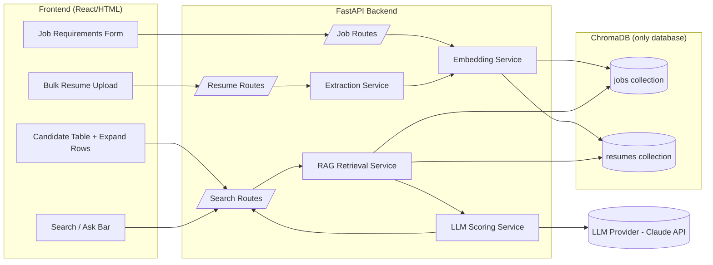
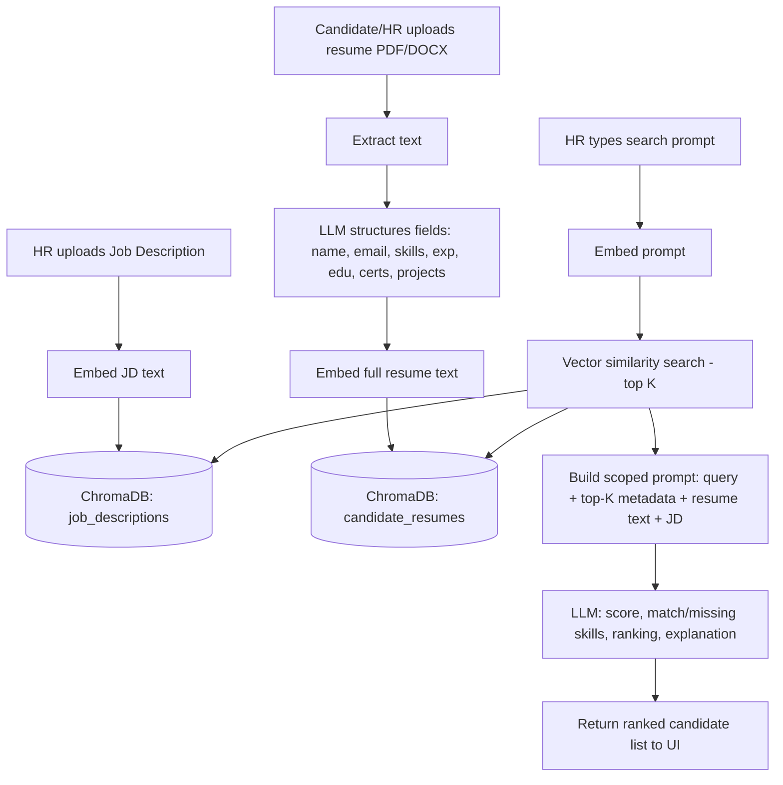
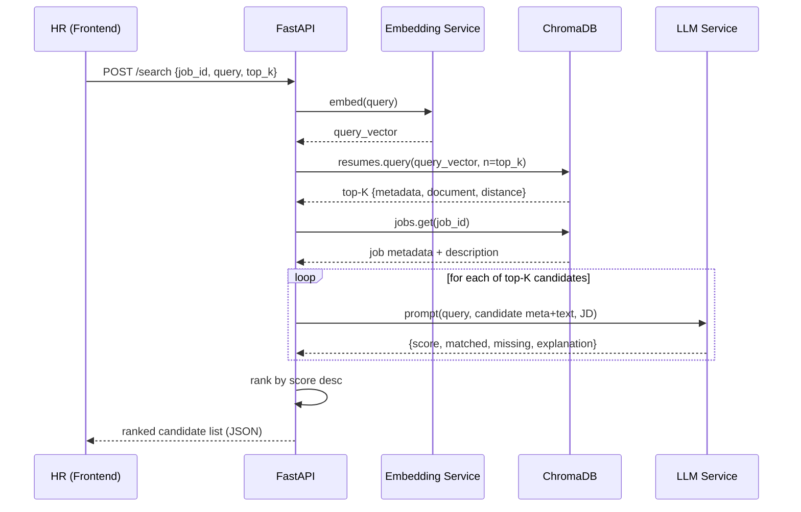
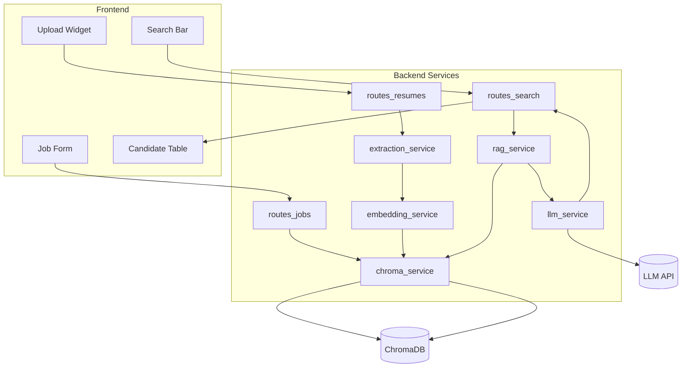
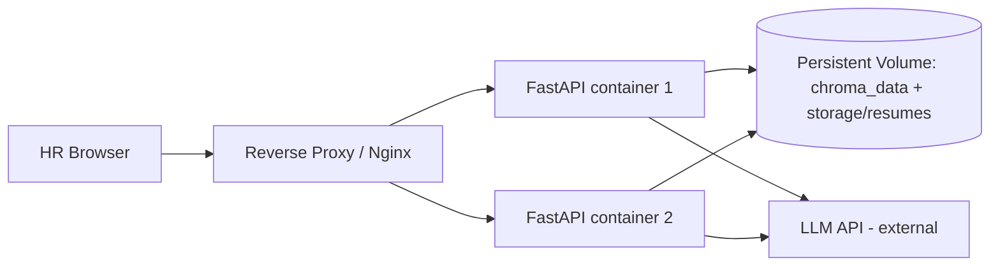

# AI-Powered ATS — System Design Document
### FastAPI + RAG + LLM + ChromaDB (single-database architecture)

---

## 1. High-Level System Architecture



**Flow in one line:** Resume/JD → parse → structured fields → single embedding → ChromaDB.
Search → embed query → vector search top-K in ChromaDB → send only retrieved metadata + text to LLM → LLM scores/ranks → return to UI.

---

## 2. ChromaDB Collection Design

Two collections only — no relational tables, no second database.

| Collection | Purpose | Embedding source |
|---|---|---|
| `job_descriptions` | One vector per job posting | Concatenated JD text (title + required_skills + description) |
| `candidate_resumes` | One vector per resume (no chunking) | Full extracted resume_text |

Each ChromaDB record = `{id, embedding, document (raw text), metadata (dict)}`.
ChromaDB's `metadata` field is used as the structured store — this removes the need for Postgres/Mongo entirely.

```python
# jobs collection
jobs_collection.add(
    ids=["job_001"],
    embeddings=[job_embedding],          # ONE vector for whole JD
    documents=[job_description_text],
    metadatas=[{
        "job_title": "...", "required_skills": "python,fastapi,sql",
        "minimum_experience": 2, "education_requirement": "Bachelor's",
        "created_at": "...", "updated_at": "...", "status": "active"
    }]
)

# resumes collection
resumes_collection.add(
    ids=["resume_a1b2"],
    embeddings=[resume_embedding],       # ONE vector for whole resume
    documents=[full_resume_text],
    metadatas=[{
        "full_name": "...", "email": "...", "phone": "...",
        "skills": "python,excel,communication",
        "total_experience": 5.8, "education": "Bachelor's",
        "certifications": "...", "projects": "...",
        "resume_file_path": "storage/resumes/resume_a1b2.pdf",
        "applied_job_id": "job_001", "uploaded_at": "..."
    }]
)
```

---

## 3. Metadata Schema

**Candidate resume metadata (Pydantic model → dict stored in ChromaDB metadata):**

```python
class ResumeMetadata(BaseModel):
    full_name: str
    email: str
    phone: str
    skills: str                # comma-separated (ChromaDB metadata is flat, no nested lists)
    total_experience: float
    experience_source: str      # "stated" | "computed"  — see Section 6a
    work_history_json: str      # JSON string: [{company, title, start_date_raw, end_date_raw}]
    education: str
    certifications: str
    projects: str
    resume_text: str           # also stored as ChromaDB "document"
    resume_file_path: str
    applied_job_id: str | None
    uploaded_at: str
```

**Job description metadata:**

```python
class JobMetadata(BaseModel):
    job_title: str
    required_skills: str       # comma-separated
    minimum_experience: float
    education_requirement: str
    job_description: str
    status: str                # active | closed
    created_at: str
    updated_at: str
```

> ChromaDB metadata values must be `str | int | float | bool` — lists (skills, certifications) are stored as comma-separated strings and split on read.

---

## 4. FastAPI Folder Structure

```
ats_backend/
├── app/
│   ├── main.py                     # FastAPI app entrypoint
│   ├── config.py                   # env vars, settings
│   ├── api/
│   │   ├── routes_jobs.py          # CRUD for job descriptions
│   │   ├── routes_resumes.py       # upload, list, delete resumes
│   │   └── routes_search.py        # RAG search + scoring
│   ├── services/
│   │   ├── extraction_service.py   # PDF/DOCX parsing + field extraction (LLM-assisted)
│   │   ├── embedding_service.py    # single embedding generation
│   │   ├── chroma_service.py       # all ChromaDB read/write logic
│   │   ├── rag_service.py          # retrieval orchestration
│   │   └── llm_service.py          # prompt building + LLM call for scoring
│   ├── models/
│   │   ├── schemas.py              # Pydantic request/response models
│   ├── core/
│   │   ├── logging.py
│   │   ├── exceptions.py
│   │   └── security.py             # API key / auth dependency
│   └── utils/
│       ├── file_parser.py          # pdfplumber / python-docx helpers
│       └── validators.py
├── storage/
│   └── resumes/                    # raw uploaded PDFs/DOCX on disk
├── chroma_data/                    # ChromaDB persistent store
├── tests/
├── requirements.txt
└── Dockerfile
```

---

## 5. REST API Endpoints

| Method | Endpoint | Purpose |
|---|---|---|
| `POST` | `/jobs` | Create job description (auto-embeds & stores) |
| `GET` | `/jobs` | List all job descriptions |
| `GET` | `/jobs/{job_id}` | Get one job description |
| `PUT` | `/jobs/{job_id}` | Update job description (re-embeds) |
| `DELETE` | `/jobs/{job_id}` | Delete job description |
| `POST` | `/resumes/upload` | Upload one or more PDF/DOCX resumes (bulk) |
| `GET` | `/resumes` | List all candidates (table view) |
| `GET` | `/resumes/{resume_id}` | Get one candidate's full parsed detail |
| `DELETE` | `/resumes/{resume_id}` | Delete a candidate (✕ button in UI) |
| `POST` | `/search` | HR prompt + job_id → ranked, scored candidates |
| `GET` | `/health` | Liveness/readiness probe |

**`POST /search` request:**
```json
{ "job_id": "job_001", "query": "who has led a team with fintech experience", "top_k": 5 }
```

**`POST /search` response (per candidate):**
```json
{
  "resume_id": "resume_a1b2",
  "full_name": "Esther Grace Aziseh",
  "score": 26,
  "matched_skills": ["Schedule and confirm appointments", "Computer and technology knowledge", "Electronic mail"],
  "missing_skills": ["Answer telephone and relay telephone calls and messages"],
  "total_experience": 5.8,
  "relevant_experience": 4.2,
  "education_match": true,
  "explanation": "Candidate meets experience and education requirements but is missing 7 of 10 required skills..."
}
```

---

## 6. RAG Workflow (no chunking, top-K only)

1. HR creates a Job Description → backend builds one embedding from the full JD text → stored in `job_descriptions`.
2. Candidate uploads resume → text extracted (PyPDF2/pdfplumber or python-docx) → LLM structures it into fields (name, email, skills, etc.) → one embedding built from the full resume text → stored in `candidate_resumes`.
3. HR searches: query text is embedded → `resumes_collection.query(query_embeddings=[q], n_results=top_k)` returns top-K candidate IDs + metadata + documents by cosine similarity.
4. Backend fetches the target Job Description by `job_id`.
5. For **each retrieved candidate only**, backend builds a scoped prompt containing: HR prompt + that candidate's metadata + full resume text + the JD — never the whole database.
6. LLM returns a structured JSON: score, matched/missing skills, experience comparison, education match, explanation.
7. Backend ranks the top-K results by score and returns them to the frontend.

---

## 6a. Experience Extraction Pipeline (Direct Pick → Regex Dates → LLM → Python Math)

Experience is **never** left to the LLM to calculate — LLMs are good at structuring messy text, bad at reliable arithmetic on dates. So this is a hybrid pipeline, applied inside `extraction_service.py` before the resume is embedded:

**Step 1 — Direct pick (cheapest path).**
If the resume explicitly states a total, e.g. *"5+ years of experience"*, grab it directly with one simple regex and stop — no LLM, no date math needed.

```python
DIRECT_EXP_RE = re.compile(r"(\d+(?:\.\d+)?)\+?\s*(?:years?|yrs?)\s*(?:of)?\s*experience", re.I)

def try_direct_experience(resume_text: str) -> float | None:
    m = DIRECT_EXP_RE.search(resume_text)
    return float(m.group(1)) if m else None
```

**Step 2 — If not explicitly stated, fall back to the structured path:**

1. **Detect the experience section** — match common headings ("Work Experience", "Employment History", "Professional Experience") and slice the text block up to the next heading.
2. **Regex is used only to locate date tokens** inside that block (`Jan 2021`, `03/2019`, `2020`, `Present`) — regex never guesses a year-count itself, it only finds where dates are.
3. **LLM structures each role into JSON** — one call, strict schema, no math asked of it:
   ```json
   [{ "company": "Acme Corp", "title": "Ops Assistant", "start_date_raw": "Jan 2021", "end_date_raw": "Present" }]
   ```
4. **Python normalizes and calculates** — parse each raw date with `dateutil.parser`, treat "Present/Current" as today, merge overlapping date ranges (concurrent roles shouldn't double-count), sum durations in months, convert to years.

```python
from dateutil import parser as dateparser
from datetime import date

def normalize_and_sum(companies: list[dict]) -> float:
    periods = []
    for c in companies:
        start = dateparser.parse(c["start_date_raw"])
        end = date.today() if c["end_date_raw"].lower() in ("present", "current") else dateparser.parse(c["end_date_raw"])
        periods.append((start, end))

    periods.sort()
    merged = []
    for s, e in periods:                      # merge overlapping ranges first
        if merged and s <= merged[-1][1]:
            merged[-1] = (merged[-1][0], max(merged[-1][1], e))
        else:
            merged.append((s, e))

    months = sum((e.year - s.year) * 12 + (e.month - s.month) for s, e in merged)
    return round(months / 12, 1)

def get_total_experience(resume_text: str, llm_structure_companies) -> tuple[float, list[dict]]:
    direct = try_direct_experience(resume_text)
    if direct is not None:
        return direct, []
    section = extract_experience_section(resume_text)
    companies = llm_structure_companies(section)      # LLM call — structuring only, no math
    return normalize_and_sum(companies), companies
```

**Result:** `total_experience` (float) is deterministic and auditable — never an LLM hallucination — and the per-company breakdown (`work_history_json`, stored as a JSON string in the flat ChromaDB metadata) travels alongside it. Only *this* verified structured data — not raw resume text guessing — is what gets handed to the RAG + LLM scoring step in Section 6, so the final score's experience comparison is grounded in real arithmetic.

---

## 7. Complete Data Flow



---

## 8. Sequence Diagram (search flow)



---

## 9. Component Diagram



---

## 10. Request/Response Flow (resume upload example)

```
Client            POST /resumes/upload (multipart, multiple files)
                  ├─ file1.pdf, file2.docx, file3.pdf
FastAPI           → for each file:
                      1. save to storage/resumes/
                      2. extract raw text (parser by extension)
                      3. call LLM to extract structured JSON fields
                      4. validate with Pydantic ResumeMetadata
                      5. generate ONE embedding from resume_text
                      6. chroma_service.add(resume)
Response          200 OK
                  [
                    {resume_id, full_name, status: "indexed"},
                    {resume_id, full_name, status: "indexed"},
                    {resume_id, status: "failed", reason: "unreadable PDF"}
                  ]
```
Frontend renders each processed row immediately into the candidate table (progressive rendering), not blocking on the whole batch.

---

## 11. Deployment Architecture



- Single Docker image for the FastAPI app; ChromaDB runs in **persistent local mode** (`PersistentClient`) mounted on a shared volume, or as its own lightweight ChromaDB server container for multi-instance access.
- Stateless FastAPI containers behind Nginx/Traefik → horizontally scalable since all state lives in ChromaDB + the volume.
- Resume files stored on the same persistent volume (or swapped for S3-compatible storage later without touching the DB layer).

---

## 12. Error Handling Strategy

- Centralized exception handlers in `core/exceptions.py` registered on the FastAPI app (`@app.exception_handler`).
- Custom exceptions: `ResumeParseError`, `UnsupportedFileType`, `EmbeddingGenerationError`, `LLMResponseError`, `ChromaDBError`, `JobNotFoundError`.
- Every API response follows one envelope:
```json
{ "success": false, "error": { "code": "UNSUPPORTED_FILE_TYPE", "message": "Only PDF and DOCX are supported" } }
```
- Bulk upload never fails the whole batch on one bad file — each file result is isolated and reported per-item (see section 10).
- LLM calls wrapped with retry (max 2 retries, exponential backoff) and a strict JSON schema; on repeated malformed output, the candidate is returned with `score: null, status: "scoring_failed"` rather than crashing the request.
- Input validation via Pydantic at the route boundary rejects bad payloads before they reach any service.

---

## 13. Logging Strategy

- Structured JSON logging (`python-json-logger` or `structlog`) — one line per event, not per print.
- Correlation ID (`request_id`) generated per request via middleware, propagated through extraction → embedding → LLM call → response, so one candidate's full journey is traceable in logs.
- Log levels: `INFO` for request lifecycle and indexing events, `WARNING` for degraded cases (partial extraction, low-confidence fields), `ERROR` for failures with stack trace, never log full resume PII at `INFO` — only IDs.
- Separate log streams: `app.log` (business events), `access.log` (uvicorn/Nginx), `llm.log` (prompt/response metadata — token counts, latency, not raw PII).

---

## 14. Scalability Considerations

- **Stateless API layer** → scale FastAPI horizontally behind a load balancer; all shared state lives in ChromaDB.
- **ChromaDB**: fine as embedded/persistent mode for an internship-scale project; for higher load, run ChromaDB as a standalone server (`chromadb.HttpClient`) so multiple API replicas share one index.
- **Async I/O**: FastAPI async endpoints for file I/O and LLM calls to avoid blocking; bulk upload processed concurrently with `asyncio.gather` (bounded concurrency, e.g. 5 files at a time).
- **Caching**: cache job embeddings in memory (jobs change rarely) to skip recomputation on every search.
- **No chunking, one embedding per document** keeps vector count low and search fast even at tens of thousands of resumes.
- Background task queue (FastAPI `BackgroundTasks` → later Celery/RQ if volume grows) for resume extraction so upload requests return fast and rows populate the table as each finishes.

---

## 15. Security Best Practices

- API key / bearer token auth on all HR-facing routes (`core/security.py` dependency); candidate upload endpoint can be public but rate-limited.
- File upload validation: enforce `.pdf`/`.docx` extension **and** MIME-type/magic-byte check, max file size (e.g. 5MB), reject executables disguised as documents.
- Store uploaded files outside the web root with randomized filenames; never trust the original filename for paths.
- Sanitize all extracted text before it's interpolated into LLM prompts (prompt-injection guard: strip instruction-like patterns such as "ignore previous instructions" found inside resume text).
- PII minimization in logs (see section 13); encrypt the storage volume at rest.
- CORS locked to the known frontend origin; HTTPS enforced end-to-end (TLS terminated at Nginx).
- Rate limiting on `/search` and `/resumes/upload` to control LLM API cost and prevent abuse.
- Secrets (LLM API key, auth tokens) via environment variables / secret manager, never committed to source.

---

## Suggested Tech Stack

| Layer | Choice |
|---|---|
| API framework | FastAPI + Uvicorn |
| Vector DB | ChromaDB (PersistentClient) |
| Resume parsing | `pdfplumber` (PDF), `python-docx` (DOCX) |
| Field extraction | LLM (structured JSON output) |
| Embeddings | LLM provider's embedding model (single call per document) |
| LLM scoring | Claude API (JSON-mode prompt) |
| Frontend | React (or plain HTML/JS) calling the REST API |
| Deployment | Docker + Nginx reverse proxy |
